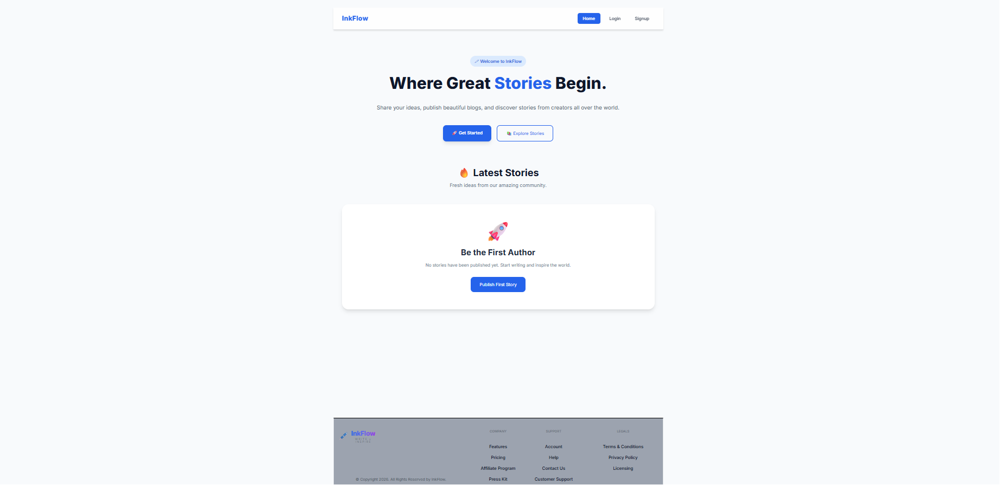
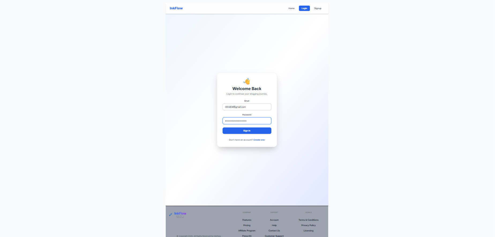
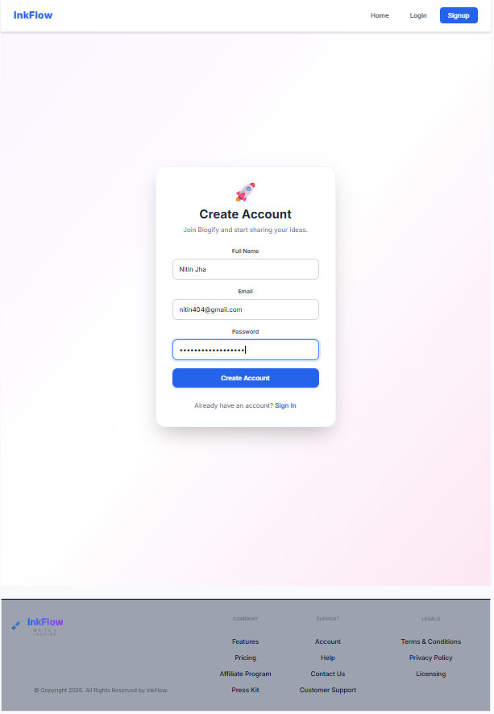
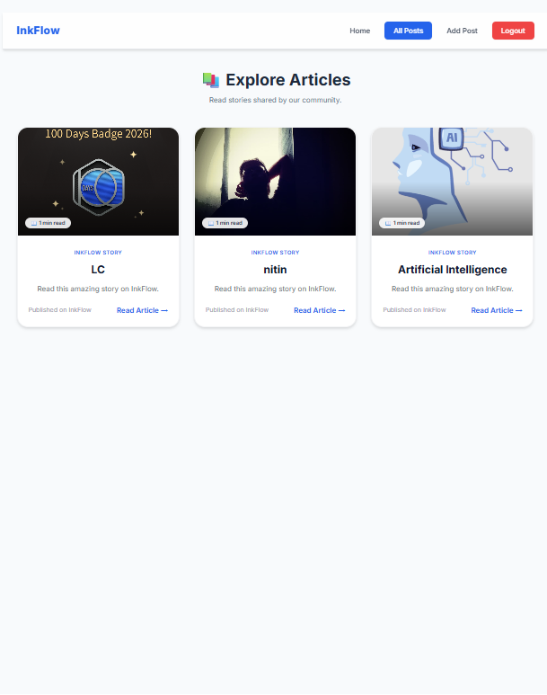

# ✍️ InkFlow

> A modern blogging platform built with **React**, **Redux Toolkit**, **Tailwind CSS**, and **Appwrite**.




---

# 📖 Overview

InkFlow is a modern blogging platform where users can:

- Create an account
- Login securely
- Publish blogs
- Edit blogs
- Delete blogs
- Upload featured images
- Read blogs from other users

The project was built while learning React and modern frontend development.

---

# ✨ Features

- 🔐 User Authentication
- ✍️ Create Blog Posts
- 📝 Edit Posts
- 🗑 Delete Posts
- 🖼 Image Upload
- 📖 TinyMCE Rich Text Editor
- 📱 Responsive Design
- ⚡ Fast Vite Development
- 🔄 Redux Toolkit State Management
- 🌐 Appwrite Backend Integration

---

# 🛠 Tech Stack

| Technology | Usage |
|------------|------|
| React | UI |
| Redux Toolkit | State Management |
| React Router | Routing |
| Tailwind CSS | Styling |
| Appwrite | Backend |
| TinyMCE | Rich Text Editor |
| Vite | Build Tool |

---

# 📂 Folder Structure

```text
InkFlow
│
├── public
├── screenshots
├── src
│   ├── appwrite
│   ├── assets
│   ├── components
│   ├── conf
│   ├── pages
│   ├── store
│   └── main.jsx
│
├── package.json
└── README.md
```

---

# 📸 Screenshots

## 🏠 Home


---

## 🔐 Login



---

## 📝 Signup



---

## 📚 All Posts



---

## ✍️ Create Post


---

## 📄 Blog Details


---

# ⚙ Installation

Clone the repository

```bash
git clone https://github.com/NitinDevCodes/React-Mini-Projects.git
```

Go into the project

```bash
cd InkFlow
```

Install dependencies

```bash
npm install
```

Create a `.env` file.

```env
VITE_APPWRITE_URL=
VITE_APPWRITE_PROJECT_ID=
VITE_APPWRITE_DATABASE_ID=
VITE_APPWRITE_COLLECTION_ID=
VITE_APPWRITE_BUCKET_ID=
VITE_TINYMCE_API_KEY=
```

Run the project

```bash
npm run dev
```

---

# 📌 Roadmap

- ✅ Authentication
- ✅ CRUD Operations
- ✅ Image Upload
- ✅ Rich Text Editor
- ✅ Responsive UI
- ⏳ Deployment
- ⏳ Dark Mode
- ⏳ Search
- ⏳ Comments
- ⏳ Likes

---

# 📚 What I Learned

While building InkFlow I learned:

- React Hooks
- Redux Toolkit
- Protected Routes
- Authentication Flow
- Appwrite Backend
- CRUD Operations
- Image Upload
- React Router
- Component Reusability
- Tailwind CSS

---

# 🚀 Future Improvements

- Deploy on Vercel
- Replace Appwrite with a custom MERN backend
- Markdown Support
- Dark Theme
- Search & Filters
- User Profiles
- Likes & Comments
- Bookmarks

---

# 👨‍💻 Author

**Nitin**

GitHub: https://github.com/NitinDevCodes

LinkedIn: https://www.linkedin.com/in/nitin-jha-a9035b30b/
